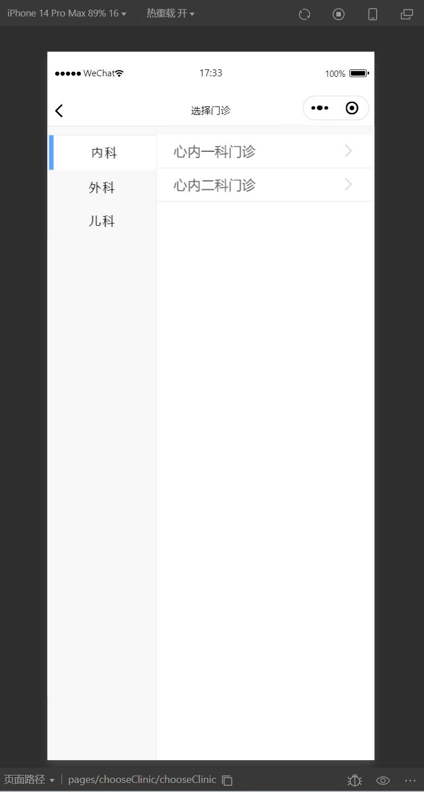

## 基于Java+Springboot+Vue的医院预约挂号小程序(源码+数据库)104

## 一、系统介绍
本系统前后端分离带小程序

小程序（用户端），后台管理系统（管理员，医生）

- 小程序：
预约挂号，就诊充值，充值记录，医生排班，挂号记录，就诊人信息，我的收藏，我的评价。

- 管理后台：
预约挂号信息管理，科室信息管理，门诊信息管理，医院排班信息管理，黑名单信息管理，收藏信息管理，充值记录信息管理，评价信息管理，公告信息管理，用户管理登录等功能。

## 二、所用技术
后端技术栈：
- Springboot
- SpringMvc
- mybatis
- mysql
- redis
- SpringSecurity

前端技术栈：
- Vue
- elementui
- vue-router
- axios
- uniapp
- 微信小程序

## 三、环境介绍
基础环境 :IDEA/eclipse, JDK 1.8, Mysql5.7及以上, Node.js(14.21), Maven3.6, Vscode, hbuilder, 微信开发者工具, redis5.0

所有项目以及源代码本人均调试运行无问题 可支持远程调试运行

## 四、页面截图
### 1、小程序app页面

### 2、管理员页面

## 五、浏览地址

- 后台访问路径：http://localhost/login?redirect=%2Findex
  admin/123456

## 六、安装教程

1. 使用Navicat或者其它工具，在mysql中创建对应名称的数据库，并执行项目的sql

2. 使用IDEA/Eclipse导入hospital-registration-back-end项目，导入时，若为maven项目请选择maven; 等待依赖下载完成

3. 修改resources目录下面application.yml里面的redis配置, 文件路径配置,application.yml里面的数据库配置

4. com/pipilin/PipilinApplication.java启动后端项目

5. vscode或idea打开hospital-registration-front-end项目

6. 在编译器中打开terminal，执行npm install 依赖下载完成后执行 npm run dev,执行成功后会显示前台访问地址

7. hbuilder打开hospital-registration-wx项目, 修改manifest.json里面的微信小程序配置AppId(从注册的微信小程序账号里面复制)

8. hbuilder点击运行-运行到小程序模拟器-微信开发者工具，然后会打开微信开发者工具，小程序页面就展示出来了(如果没有微信小程序开发工具也可以运行到浏览器打开)

